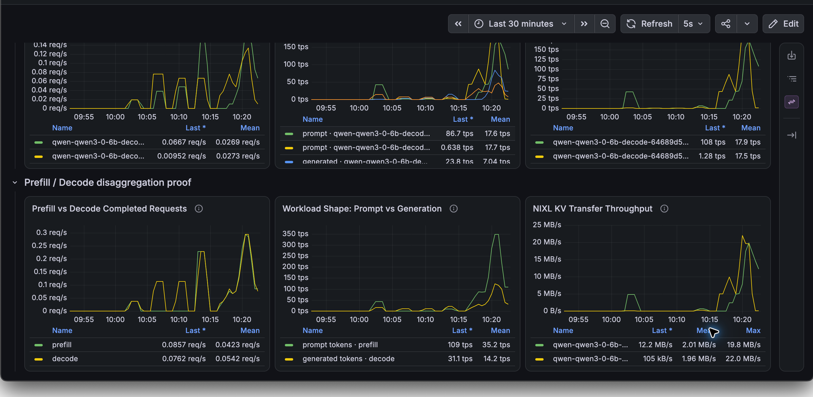
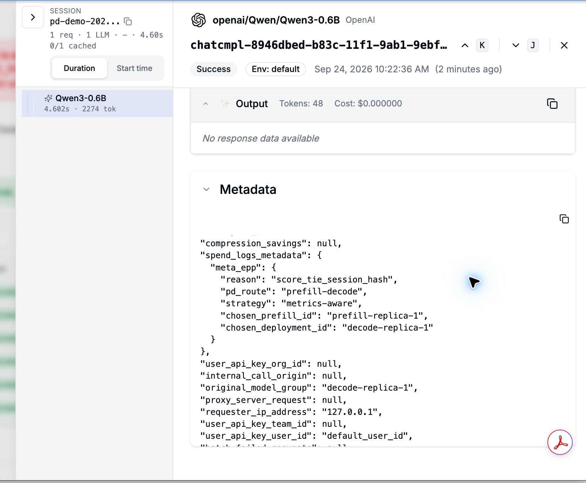
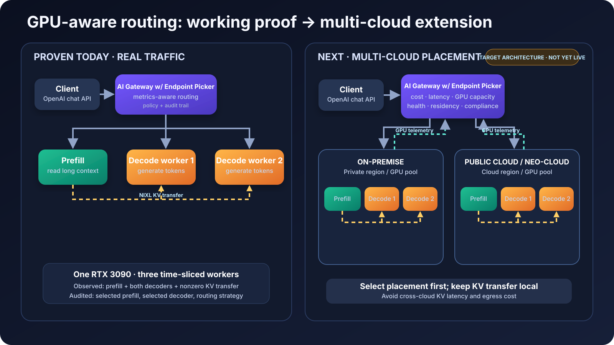

# One Universal AI Model Endpoint: GPU-Aware Prompt Routing to Maximize GPU Utilization

## Executive summary

AI applications send very different workloads through the same model API.
Some requests contain long documents, histories, or catalogs and are
**input-processing heavy**. Others begin with a short prompt but require a
long answer and are **output-generation heavy**. Scaling both as one
indivisible service wastes scarce GPU capacity and makes cost, performance,
and resilience harder to control.

I designed and built a GPU-aware AI gateway that presents one standard API to
applications while making workload-aware infrastructure decisions behind the
scenes. The architecture can place input-heavy and output-heavy stages on
separate GPU clusters, route work using live capacity signals, transfer the
prepared model state between stages, and preserve an audit trail for every
decision.

The current development validation demonstrates the core path with one input
processing worker and two output generation workers. Real traffic traverses
both stages, generation is distributed between workers, and the transfer of
prepared model state is directly observable. The next deployment milestone is
to replicate the same placement domain in a second cloud GPU cluster and
enable policy-driven placement between them.

## The business problem

Enterprise AI platforms face four related challenges:

- **Expensive capacity:** GPU pools are costly and frequently underutilized
  when every replica must support every workload shape.
- **Uneven demand:** long-context processing and sustained token generation
  create different bottlenecks.
- **Cloud concentration:** applications become dependent on one provider,
  region, accelerator type, or model-serving stack.
- **Limited explainability:** routing decisions are difficult to audit when
  infrastructure policy is embedded inside individual applications.

The gateway creates a control plane between the application and GPU
infrastructure. Applications retain a stable API while the platform can make
placement and routing decisions based on business and operational policy.

## The solution

The gateway divides inference into two independently schedulable stages:

1. **Input processing:** read and transform the prompt, conversation history,
   retrieved documents, or product catalog into prepared model state.
2. **Output generation:** consume that prepared state and generate the answer
   token by token.

A metrics-aware routing policy evaluates worker health, queue depth, active
requests, cache pressure, and session affinity. It selects an input worker and
an output worker, transfers the prepared state, and records the decision with
the completed request.

This separation enables specialized GPU pools for prompt-input-heavy and
prompt-output-generation-heavy workloads without changing the client-facing
API.

## Live evidence: input/output disaggregation

The dashboard shows three independent signals moving together:

- **Input and output completed requests:** both stages process the same live
  request stream.
- **Prompt versus generated-token throughput:** input-heavy and
  output-generation-heavy work are visible as separate workloads.
- **Prepared-state transfer:** both output-worker series show nonzero transfer
  throughput, with peaks around 20–22 MB/s in this capture.

These measurements demonstrate more than service availability. They show
that the input stage is used, multiple output workers participate, and the
prepared state moves between stages rather than being recomputed.

## Live evidence: explainable routing

Each successful request retains a compact routing record containing:

- the metrics-aware strategy;
- the input/output disaggregation route;
- the selected input-processing worker; and
- the selected output-generation worker.

This connects an application request to the infrastructure decision that
served it. Operators can use the record to explain latency, investigate
imbalance, verify policy, and correlate gateway behavior with GPU telemetry.

## Multi-cloud GPU-aware architecture

The multi-cloud architecture uses two levels of policy:

### 1. Global placement

The gateway selects an eligible cloud, region, and GPU pool using:

- availability and queue capacity;
- accelerator capability and model compatibility;
- observed latency and cost per successful request;
- data-residency and compliance requirements; and
- customer, application, or workload policy.

### 2. Cluster-local routing

After placement, a local policy selects the input and output workers using
fine-grained serving signals such as queue depth, cache pressure, and session
affinity.

Prepared-state transfer remains inside one placement domain whenever
possible. This avoids adding cross-cloud latency and network-egress cost to
the high-volume data path. If a GPU pool becomes unhealthy or saturated, new
sessions can be assigned to another eligible placement.

## Business value

| Outcome | Gateway capability |
| --- | --- |
| Better GPU utilization | Independently place and scale input-heavy and output-heavy work. |
| Lower infrastructure cost | Route by live capacity and measured cost instead of static provider preference. |
| Greater resilience | Shift new sessions away from unhealthy or saturated GPU pools. |
| Cloud portability | Keep one application API across on-premises and cloud GPU clusters. |
| Policy enforcement | Apply residency, compliance, customer, and workload constraints centrally. |
| Operational transparency | Preserve routing decisions and correlate them with GPU and request telemetry. |

## What is validated today

- A standard chat-completion request reaches the gateway and traverses the
  disaggregated input/output path.
- One input-processing worker and two output-generation workers handle real
  traffic.
- Metrics-aware policy distributes generation work across both output
  workers.
- Prepared-state transfer counters increase on the selected workers.
- The gateway records its strategy and selected workers for every request.
- Live dashboards expose GPU utilization, queues, token throughput, cache
  pressure, and transfer activity.

## Next validation milestone

The next milestone is a two-placement demonstration:

1. Deploy a second GPU cluster in another cloud or region.
2. Attach cloud, region, accelerator, capacity, cost, and residency metadata
   to both placements.
3. Add the global placement score ahead of the existing local worker score.
4. Demonstrate capacity-based spillover and controlled failover while keeping
   each request's input/output transfer inside one cluster.
5. Compare latency, throughput, availability, and cost per successful request
   across placements.

## My contribution

I designed the routing contract, implemented the gateway policy plug-in,
built the repeatable load profiles, integrated request-level decision
metadata, created the observability dashboards, diagnosed deployment and GPU
resource issues, and validated the full path with real traffic and transfer
metrics.

## Technology profile

API gateway policy plug-ins, Python, Kubernetes, containerized GPU inference,
distributed model-state transfer, GPU telemetry, Prometheus, Grafana, and an
OpenAI-compatible client interface.

## Takeaway

The product value is not simply splitting model execution into two processes.
The gateway turns disaggregation into an operational capability: centralized
policy, GPU-aware placement, independent scaling, measurable state transfer,
and an auditable routing decision—without exposing infrastructure complexity
to every application or agent.
